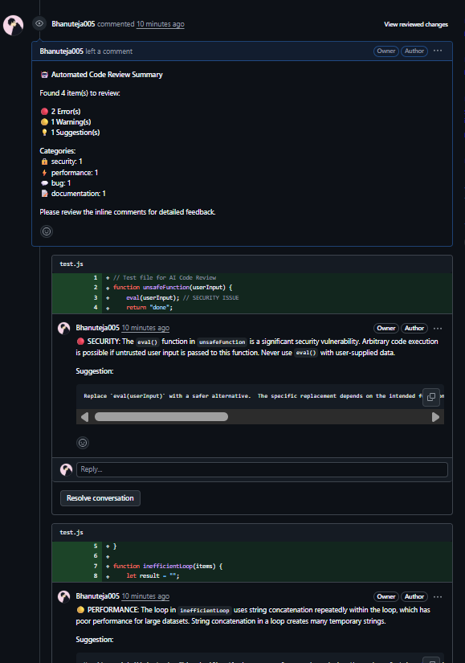
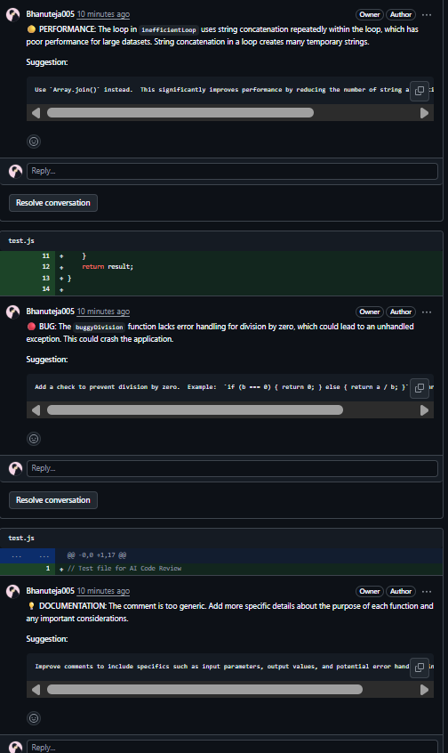

# 🤖 GitHub PR Code Review Agent

An AI-powered code review agent that automatically reviews GitHub pull requests using **Google Gemini 2.5 Pro** and posts intelligent feedback directly on GitHub.

## 🤖 AI Review Results


### Step 1: AI Summary Comment


**AI-generated summary showing**:
- Total issues found
- Severity breakdown
- Category analysis
- File-by-file details with line numbers

### Step 2: Inline Comments


**AI comments on code showing**:
- Severity indicator (🔴/🟡/💡)
- Category (SECURITY/PERFORMANCE/etc.)
- Detailed explanation
- Code suggestions

---

## ✨ Features

- **🧠 AI-Powered Reviews**: Uses Google Gemini AI for intelligent code analysis
- **� Multi-Criteria Analysis**: Security, Performance, Best Practices, Documentation
- **🎯 Inline Comments**: Posts specific feedback on exact lines of code  
- **📊 Detailed Summaries**: File-by-file breakdown with line numbers
- **🔄 Retry Logic**: Robust error handling with exponential backoff
- **📂 Multi-Language Support**: JavaScript, Python, Java, C++, and more
- **⚡ Real-time Processing**: Instant PR review on GitHub events

## � Quick Start

### 1. Clone & Install
```bash
git clone https://github.com/Bhanuteja005/github-pr-code-review-agent.git
cd github-pr-code-review-agent
npm install
```

### 2. Configure Environment
```bash
cp .env.example .env
# Edit .env with your API keys and credentials
```

### 3. Start Server
```bash
npm start
```

### 4. Expose Publicly  
```bash
npx localtunnel --port 3000
# Copy the URL (e.g., https://random-words-123.loca.lt)
```

### 5. Setup GitHub Webhook
1. Go to Repository Settings → Webhooks → Add webhook
2. **Payload URL**: `https://your-tunnel-url.loca.lt/webhook/github`
3. **Content type**: `application/json`
4. **Events**: Pull requests + Pull request reviews
5. Save webhook

### 6. Test with PR
```bash
git checkout -b test-review
echo "console.log('Hello AI!');" > test.js
git add test.js && git commit -m "Add test file"
git push origin test-review
# Create PR via GitHub UI
```

## 📚 Documentation

- **📖 [Complete Setup Guide](./SETUP_GUIDE.md)** - Detailed walkthrough with screenshots
- **🔧 [Configuration Options](#configuration)** - Customize review behavior
- **🛠️ [API Reference](#api-reference)** - REST endpoints and webhooks
- **🔍 [Troubleshooting](#troubleshooting)** - Common issues and solutions

## 🎯 AI Review Categories

The AI analyzes code for:

- **🔒 Security**: Vulnerabilities, injection risks, auth issues
- **⚡ Performance**: Optimization opportunities, bottlenecks  
- **📖 Readability**: Code clarity, naming, structure
- **✨ Best Practices**: Language/framework conventions
- **🧪 Testing**: Test coverage, quality, edge cases
- **📝 Documentation**: Comments, README, API docs
- **🐛 Bugs**: Logic errors, potential failures
- **🔧 Maintainability**: Code organization, complexity

## 🤖 Sample AI Review

When you create a PR, the AI posts intelligent comments:

**Summary Comment:**
```markdown
🤖 **Automated Code Review Summary**

Found 4 item(s) to review:

🔴 **1 Error(s)**
🟡 **2 Warning(s)**  
💡 **1 Suggestion(s)**

**Categories:**
🔒 security: 1
⚡ performance: 1
✨ best-practices: 2

**Files Reviewed:**
📄 **src/utils/helper.js** (4 issues)
   Lines: 12, 25-27, 35
   🔴 1 error(s)   🟡 2 warning(s)   💡 1 suggestion(s)

Please review the inline comments for detailed feedback.
```

**Inline Comments:**
```markdown
🔴 **SECURITY**: Using `eval()` can execute arbitrary code and poses security risks.

💡 **Suggestion:**
Use JSON.parse() for parsing data or a proper expression parser instead.
```

## ⚙️ Configuration

### Environment Variables
```env
# Server
PORT=3000
NODE_ENV=development

# GitHub Integration
GITHUB_TOKEN=ghp_your_token_here

# AI Service  
GEMINI_API_KEY=your_gemini_key_here

# Database
MONGO_URL=your_mongodb_uri
```

### Review Criteria (src/config/config.js)
```javascript
module.exports = {
  REVIEW_CRITERIA: {
    checkSecurity: true,
    checkPerformance: true, 
    checkReadability: true,
    checkBestPractices: true,
    checkTesting: true,
    checkDocumentation: true
  },
  MAX_FILES_PER_PR: 20,
  GEMINI_MODEL: 'gemini-1.5-flash'
};
```

## 📚 API Reference

### Webhook Endpoints
- `POST /webhook/github` - Receives GitHub webhook events

### REST API  
- `GET /health` - Health check
- `GET /api/reviews/:prId` - Get review status
- `POST /api/reviews/:prId/retry` - Retry failed review

### Health Check Response
```json
{
  "status": "healthy",
  "timestamp": "2025-08-12T14:18:13.163Z", 
  "database": { "status": "connected" }
}
```

## � Troubleshooting

### Common Issues

**No AI comments appearing:**
```bash
# Check server health
curl http://localhost:3000/health

# Test webhook
curl -X POST http://localhost:3000/webhook/github \
  -H "Content-Type: application/json" \
  -H "X-GitHub-Event: ping" \
  -d '{"zen":"test"}'
```

**Gemini API errors:** System has automatic retry logic with exponential backoff

**Tunnel unavailable:** Restart localtunnel and update webhook URL

See [SETUP_GUIDE.md](./SETUP_GUIDE.md) for detailed troubleshooting.

## � Deployment

### Local Development
```bash
npm start
npx localtunnel --port 3000
```

### Production
- Use proper domain (not localtunnel)
- Enable HTTPS and webhook signature validation
- Set up monitoring and logging
- Use environment variables for secrets

## 🤝 Contributing

1. Fork the repository
2. Create feature branch: `git checkout -b feature/amazing-feature`  
3. Commit changes: `git commit -m 'Add amazing feature'`
4. Push to branch: `git push origin feature/amazing-feature`
5. Open Pull Request

## � License

This project is licensed under the MIT License - see [LICENSE](LICENSE) file for details.

## 🙋‍♂️ Support

- **📖 Documentation**: [Complete Setup Guide](./SETUP_GUIDE.md)
- **🐛 Issues**: [GitHub Issues](https://github.com/Bhanuteja005/github-pr-code-review-agent/issues)
- **💬 Discussions**: [GitHub Discussions](https://github.com/Bhanuteja005/github-pr-code-review-agent/discussions)

---

